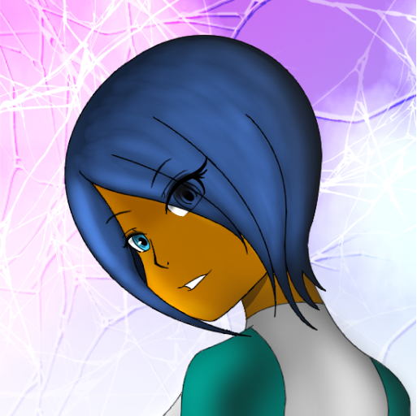

# Enhancing The Blog

## Overview

The blog was recently updated with the addition of features applied to the Mkdocs Material framework. Some HTML was applied like the announce box reminding you that the site is currently in construction, in terms of the features that I apply to the site's framework.

<!-- more -->

Here are the features that were added into the framework to enhance the post's interactions:

- Added global navigation features such as Search Suggestions
- Enabling admonitions (callouts), footnotes, tasks lists, and other markdown essentials.
- Updated site theme that relies on the system theme preferences.
- Adding icons for keyboard keys! (Don't press ++ctrl+alt+del++ on the keyboard!)
- And finally...ADDING THE GRID CARDS!

- This how the cards will appear with this feature enabled.
- It can give me some ideas to overview some topics
- It's kind of pretty cool...
- AND AWESOME!

That's the good part of enhancing the blog! But pretty cool when I'm experimenting in Markdown coding and blogging at the same time!

## Predefined authors
---
While building the site at the pure blog state, I created a `.authors.yml` file to add predefined authors since I'm going to be using existing characters to add their roles in the blog. Here are the current authors that you will see here:

{ align=left width=75 }
**Amira Fernandez**, the mascot of the content I create, will represent updates for **Afterzone Nova**, the official Discord server. This will replace **Amira's Information Desk** on the server since all of her posts and updates will appear in the blog site.
---
{ align=left width=75 }
**Crystal Ashiro**, the third flagship character, will represent her role for development updates of **Unfragmented.**
??? info "Regarding Crystal Ashiro"

    Since Unfragmented's development has been paused and saved, you will see some of Crystal's posts in the distant future if the development of the game resumes, in terms how the size of the project will be.
---
**Rachel Jordan** will be decided on what her predefined role will be in the blog. Stay tuned for updates on my socials regarding her role in the blog!

## Conclusion
---
I'm looking forward to start posting regular updates here and continuing to add functionality to the site! Stay tuned for an updated version of this post in the nearby future.
