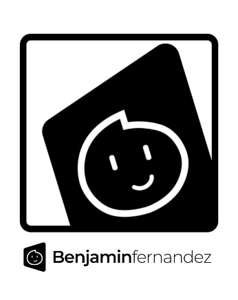

# August has arrived, what's going on for this month?

The month of August has just arrived, and I've been having a summer that's half-good and half-ugly. Despite of being unemployed still, most of the jobs that I've applied at, has not reached out to me after I did follow-ups on the phone, it was getting difficult and stressful at this point.

However, there are responsibilities that were already taken and done and have tried so hard on that but nothing has happened ever since regarding this issue.

Putting that aside, I was still able to participate ConnectiCon XXI last month which is my second year going there. Plus, some of the people who I followed on Instagram, including my friends from Team Pyro[^3], were also there last year, returned as their respective vendors.

!!! info "Speaking of Team Pyro..."
    Stay tuned for a new upload from both Pyropen Art and Bunny's Resin Art on YouTube, as they document the trip to ConnectiCon XXI as a vlog post. **Plus, you will see me there in the video.** Please support the artists and stay updated with their fresh content by following their socials!

<!-- more -->

So for the month of August, there are only two cons left I may or may not go to, like TerrifiCon and RetroWorld Expo. It depends how much money I have left to spend on. (Well I say I might pay for TerrifiCon and ditch RetroWorld Expo to save up. I will go to RetroWorld next year, if planned.)

## What happened recently for new content...
{ align=left width=200}
### New Logo, Same Content!
Not too long ago, a new logo badge was made. It consist my branding logo...IN A BOX! I had this design style for quite sometime last year so I decided to revamp that design style and mark it as the new logo badge. The logo will have three variants: The generic version, the new signature badge, and the "DESIGNED FOR" badge.

***Keep an eye out for this badge in future illustrations.***

### Updated the GitHub profile
Well, for those who are using GitHub to manage their repositories, their codebase, and others. I have updated my profile `README.md` to represent the tools and languages I'm currently using. I have to say, :simple-markdown:**Markdown** is the only language I'm still getting used to (it's all because of me using :simple-obsidian:**Obsidian** and :material-microsoft-visual-studio-code:**Visual Studio Code** to write down my blog posts).

## What about Afterzone Nova?
Due to it's inactive state, the Discord server is mostly abandoned at this point like a studio or a video rental store. However, I can try to get the server to be active again but I need to do some server clean-up.

Amira[^1] will be posting her update soon on the blog so check back for her first post on the site.

## For the fall season and beyond...
Since I haven't been working on new content recently, I will return making content, to finish where I continued off. These are the list of projects I will be finishing up during this month:

| Project Name             | Description                              | Status                  |
| :----------------------- | :--------------------------------------- | :---------------------- |
| Summer Illustration      | Features the mascot in the summer season | Planned                 |
| Amira's Heart            | The second illustration in Enhanced[^2]  | Needs to be finished    |
| The "Designed For" Badge | The badge for Team Pyro                  | Needs to be finished    |

There are no deadlines for these three, it depends whether I can work on them or not, but I need to finish them soon so I can worked on the new project that is planned.

[^1]: Amira is the mascot of Benjamin Fernandez Media, her mention is referring to the role of posting updates for the Afterzone Nova Discord server.
[^2]: Enhanced is a series of illustrations, consisting of newer version of older illustations from 2020 or later.
[^3]: Team Pyro refers to the artist duo of Pyropen Art and Bunny's Resin Art.
